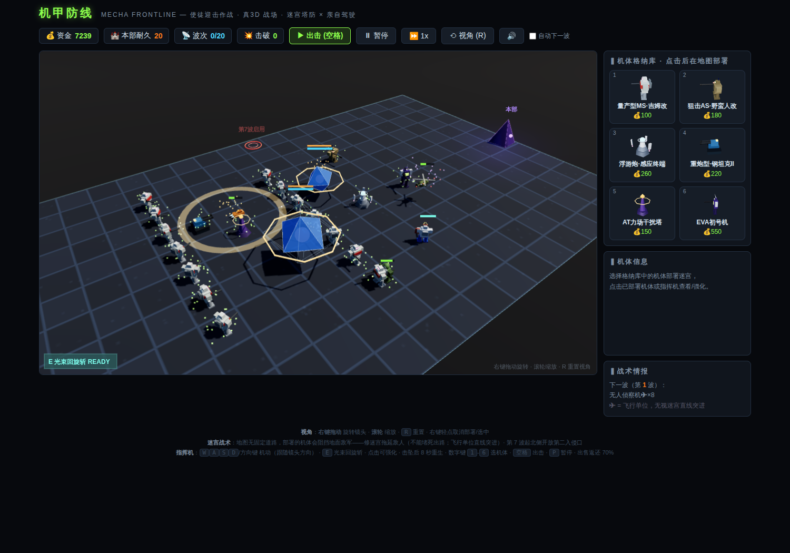

# 机甲防线 MECHA FRONTLINE

真 3D（WebGL / Three.js）网页塔防游戏。融合高达 / 全金属狂潮 / 新世纪福音战士的机甲题材，
玩法参考 **Tower Madness**（开放地形迷宫塔防）与 **Thronefall**（可亲自操纵的指挥单位）。



## 怎么玩

直接用浏览器打开 `index.html` 即可（Three.js 已内联进单文件，无需联网、无需安装）。

## 美术：真 3D 战场

- **可旋转镜头**：右键拖动旋转、滚轮缩放、`R` 重置视角（轨道相机，俯仰有限位）
- **程序化建模机体**：每台机体由 10~20 个几何部件（圆柱/胶囊/棱锥/八面体…）拼装，
  上半身/炮塔独立旋转实时指向目标；浮游炮环绕漂浮、直升机旋翼旋转、推进器喷焰
- **实时光影**：平行光阴影贴图（PCF 软阴影）+ 半球环境光 + ACES 色调映射
- 使徒 Boss 为半透明悬浮**正八面体**（雷天使式），内部红色核心 + 线框光晕 + AT 力场光环
- 特效：加法混合光束、GPU Points 粒子（带重力回弹）、榴弹抛物线弹道 + 溅射冲击环
- 商店图标由真实 3D 模型离线渲染生成

## 核心玩法

- **迷宫塔防（Tower Madness 式）**：地图没有固定道路。部署的机体本身就是墙，
  地面敌军实时寻路（BFS 流场）绕行——修出迷宫拖延敌人。系统禁止把路完全堵死；
  飞行单位（无人机、武装直升机）无视地形直线突进。第 7 波起开放第二入侵口。
- **亲自驾驶指挥机（Thronefall 式）**：`WASD`/方向键驾驶白色指挥机（方向跟随镜头），
  自动开火，`E` 释放光束回旋斩。点击指挥机可强化；被击坠后 8 秒重生。
- **20 波敌袭**，第 5/10/15/18/20 波出现使徒级 Boss：AT 力场（会再生的护盾）+ 重装甲。

## 可部署机体

| 机体 | 造价 | 特点 |
| --- | --- | --- |
| 量产型MS·吉姆改 | 100 | 高射速机枪，杂鱼收割 + 便宜的迷宫墙 |
| 狙击AS·野蛮人改 | 180 | 超远程高伤，**完全穿甲**，克重装 |
| 浮游炮·感应终端 | 260 | 同时锁定 3 个目标的光束，50% 穿甲 |
| 重炮型·钢坦克II | 220 | 范围溅射，克密集地面编队，**无法对空** |
| AT力场干扰塔 | 150 | 范围减速（含飞行，Boss 减半），无伤害 |
| EVA初号机 | 550 | 高伤光束，15% 几率**暴走**造成 3 倍伤害 |

所有机体可升 3 级，出售返还 70%。敌人有装甲值（直接减伤），光束/狙击类武器可穿透。

## 操作一览

| 操作 | 功能 |
| --- | --- |
| 右键拖动 / 滚轮 / `R` | 旋转镜头 / 缩放 / 重置视角 |
| `1`–`6` + 左键 | 选择机体并部署 · 右键轻点或 `Esc` 取消 |
| `WASD` / 方向键 | 驾驶指挥机（跟随镜头方向） |
| `E` | 光束回旋斩 |
| `空格` / `P` | 出击下一波 / 暂停 · 顶栏可切 1x/2x/3x 速度与音效 |

## 工程结构

```
index.html          构建产物：单文件成品（Three.js + 游戏代码已内联，双击即玩）
src/game.js         游戏源码（逻辑 + 3D 渲染，可读版本）
src/template.html   页面模板（UI/样式）
vendor/three.min.js Three.js r152（MIT License，UMD 构建）
build.py            构建脚本：python3 build.py → 重新生成 index.html
```

修改 `src/` 下的代码后运行 `python3 build.py` 重新生成单文件成品。
